<p align="center">
  
</p>

<h3 align="center">Opscenter —— 以数据库管理为核心的现代化运维管理平台</h3>

<p align="center">
  
  
  
  
</p>

---

## Opscenter 是什么？

**Opscenter 是一个面向运维、DBA 和平台工程团队的综合运维管理平台，当前重点强化数据库全生命周期管理能力。**

平台采用 Go + Vue 前后端分离架构，围绕数据库实例纳管、结构发现、SQL 控制台、查询审计、备份恢复、PITR、复制治理、容量分析和诊断巡检构建核心工作台，同时提供主机资产、Web 终端、远程桌面、消息队列、Kubernetes、监控告警、SSL 证书、Nginx 日志分析和任务编排等运维能力。

---

## 核心亮点

### 数据库管理工作台

- 统一纳管 MySQL、MariaDB、PostgreSQL、Redis、SQL Server、ClickHouse、Oracle、TiDB、OceanBase、openGauss、Kingbase 等多类实例。
- 支持实例生命周期、凭据绑定、连接测试、启停状态、业务系统、负责人、环境和标签管理。
- 支持 Schema / 表 / 字段 / 索引 / 表关系发现，DDL 预览和数据字典导出。
- 提供 SQL 控制台，覆盖只读查询、写 SQL 校验、DDL 校验、格式化、执行计划和结果导出。

### 备份、恢复与 PITR

- 支持逻辑备份、物理备份、全量 / 增量策略、备份链校验和合成全量。
- 支持 MySQL binlog 归档、PostgreSQL Barman / pg_basebackup 相关能力。
- 支持恢复计划、隔离恢复、恢复演练、恢复证明和备份可恢复性校验。
- 支持备份风险画像、保护策略、RPO / RTO、告警规则和恢复演练过期提醒。

### 数据库治理与安全

- 数据库实例级对象权限：查看、查询、导出、写入、备份、恢复、诊断、拓扑、管理等。
- 写操作、DDL 和高风险操作支持策略控制、原因填写、二次确认、影响行数限制和回滚提示。
- 查询审计、操作审计、数据日志、终端审计和会话录制统一留痕。
- 支持 MFA、登录审计、系统配置、菜单权限和按钮级 RBAC。

### 运维生态扩展

- 主机资产、凭据、业务分组、Agent、Web SSH 终端、远程桌面和虚拟化平台管理。
- RabbitMQ、Kafka、RocketMQ、ActiveMQ、Pulsar 消息队列治理。
- Kubernetes 多集群管理、任务中心、监控中心、SSL 证书管理和 Nginx 日志分析通过插件化能力扩展。

---

## 项目演示图

<table>
  <tr>
    <td>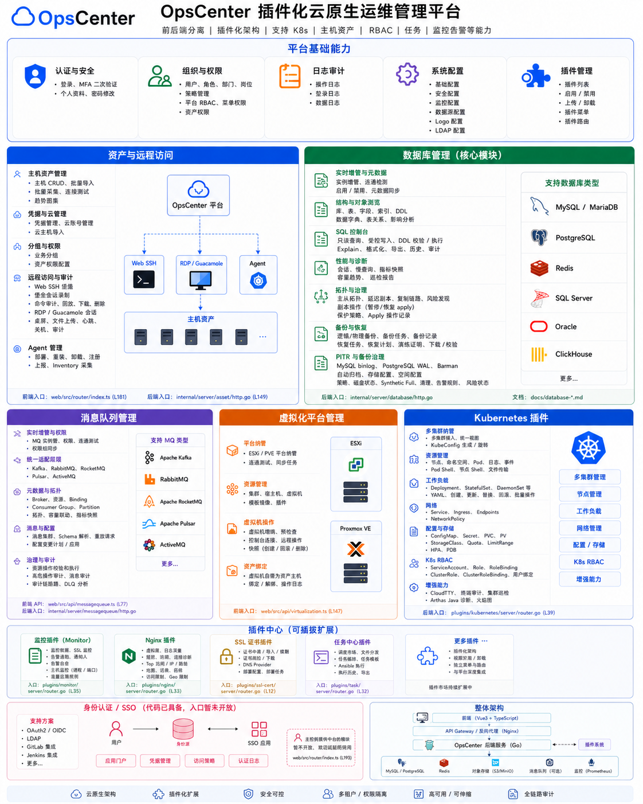</td>
    <td>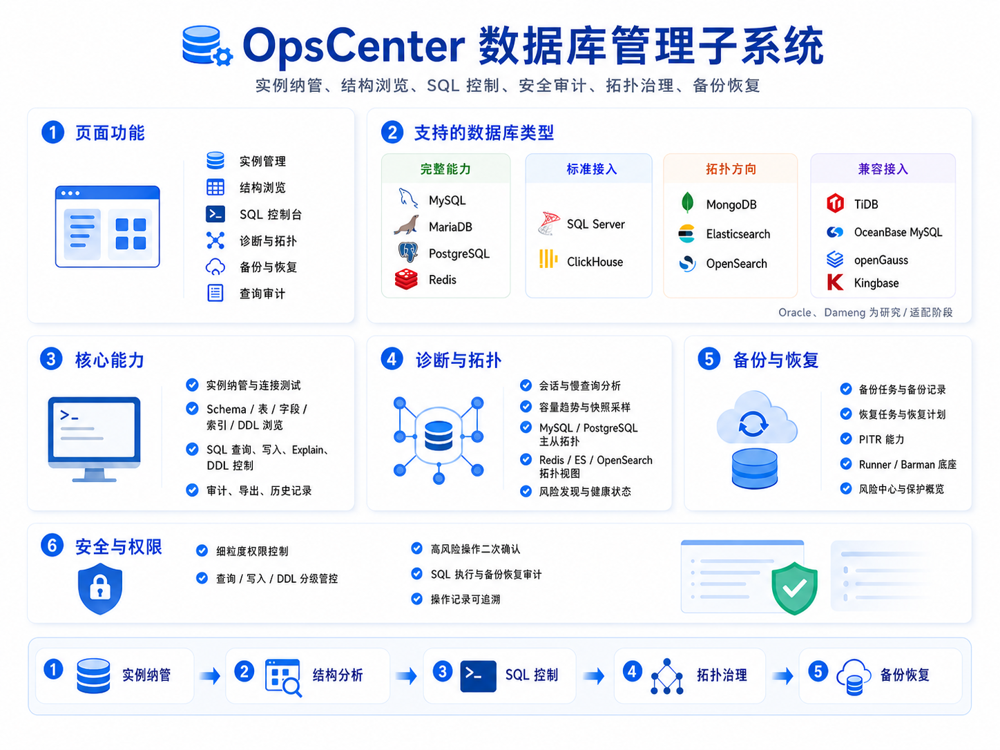</td>
  </tr>
  <tr>
    <td>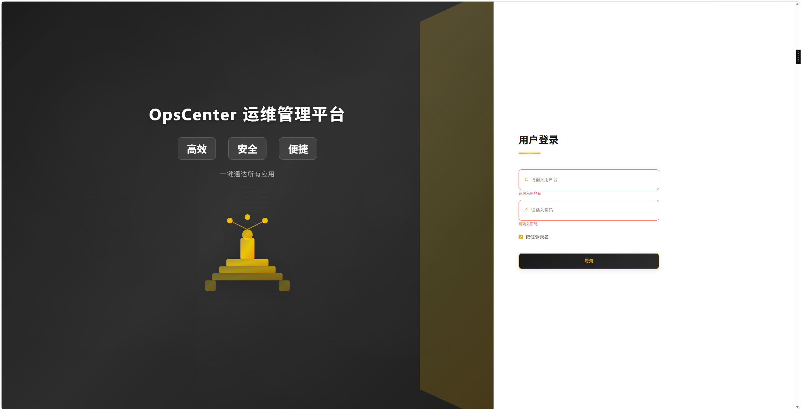</td>
    <td>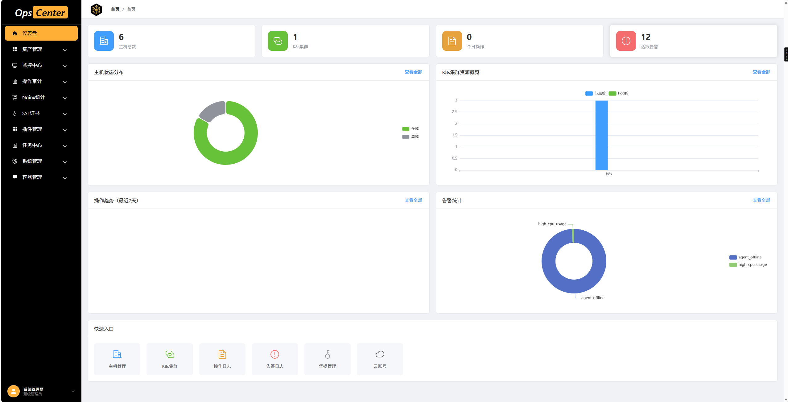</td>
  </tr>
  <tr>
    <td>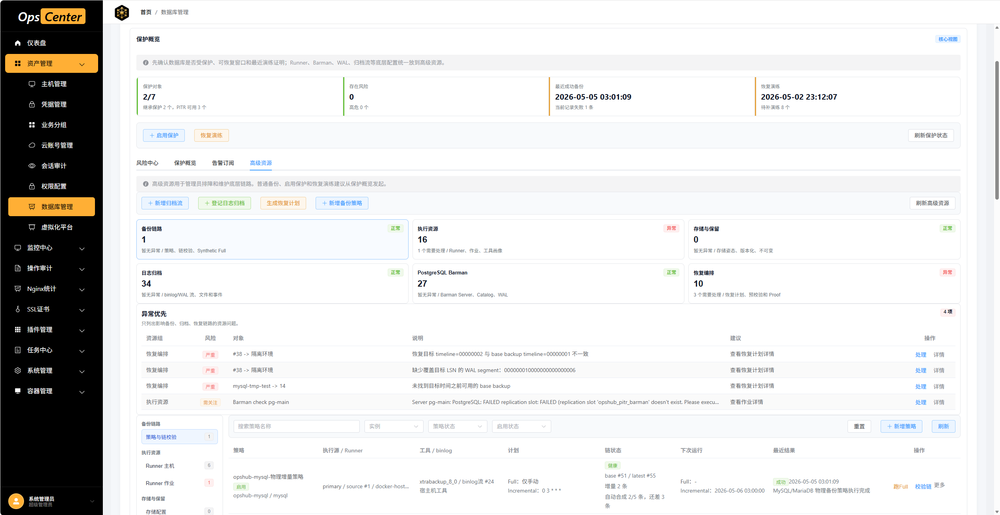</td>
    <td>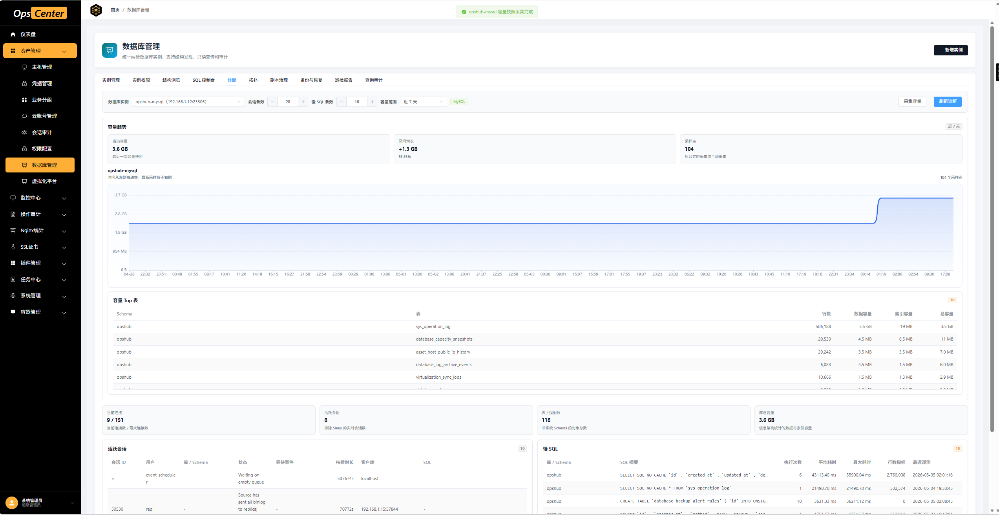</td>
  </tr>
  <tr>
    <td>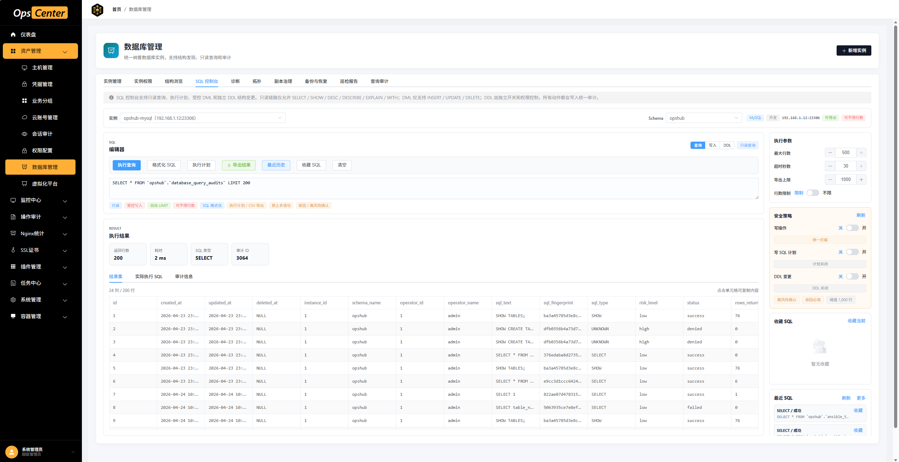</td>
    <td>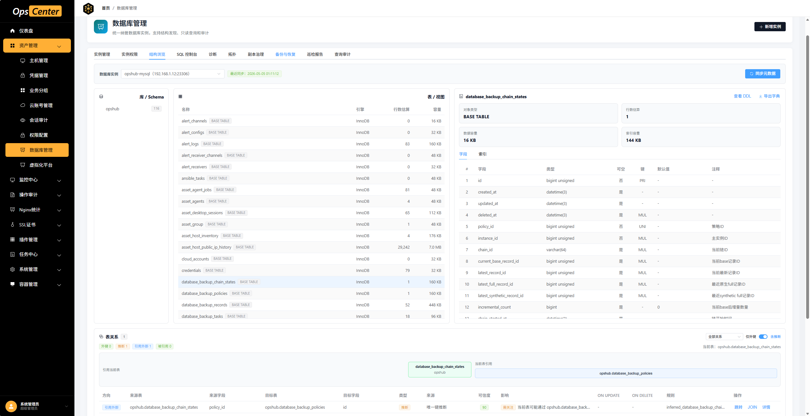</td>
  </tr>
  <tr>
    <td>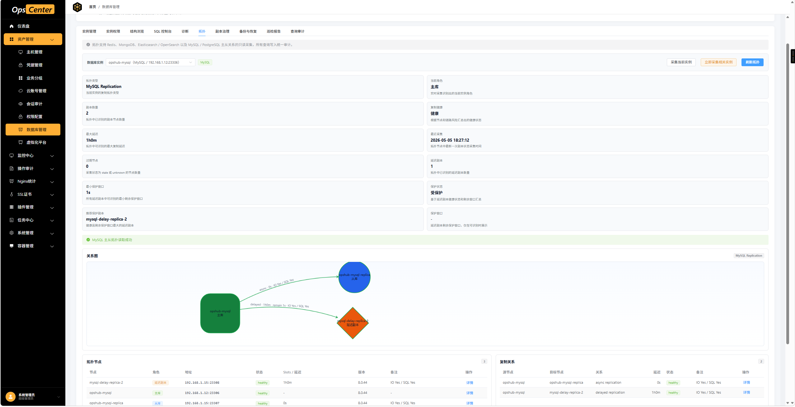</td>
    <td>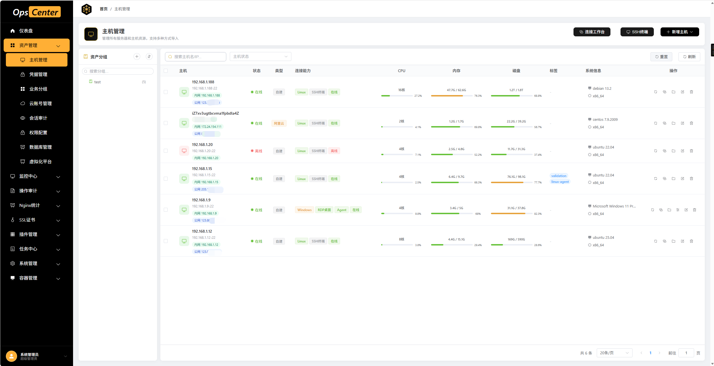</td>
  </tr>
  <tr>
    <td>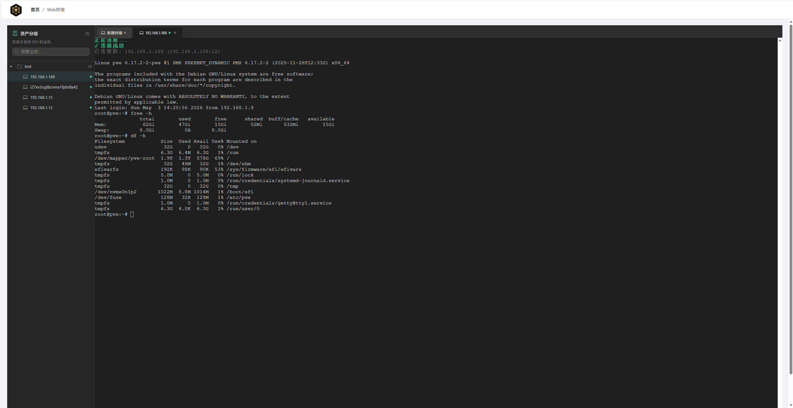</td>
    <td>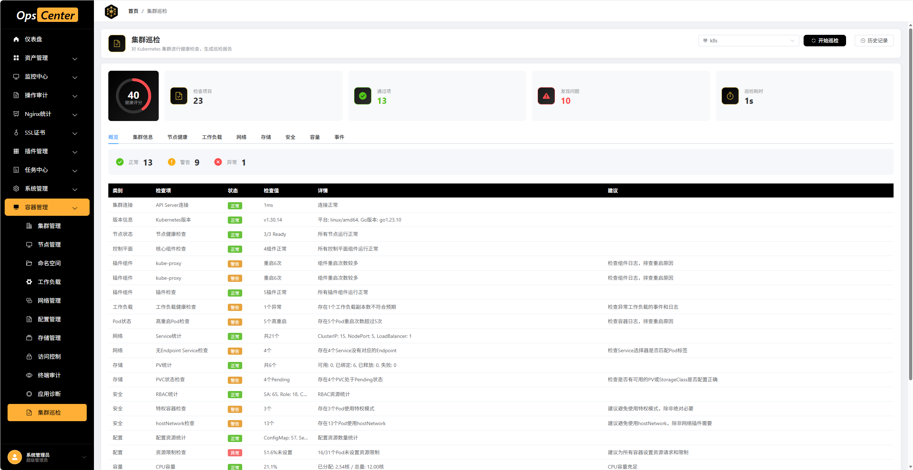</td>
  </tr>
</table>

---

## 功能特性

### 数据库管理

| 功能模块 | 描述 |
|:---------|:-----|
| 实例管理 | 数据库实例 CRUD、连接测试、启用 / 禁用、环境、业务系统、负责人和标签维护 |
| 实例权限 | 按角色分配实例级权限，支持查看、查询、导出、写入、备份、恢复、诊断、拓扑和管理 |
| 结构浏览 | 同步 Schema、表、字段、索引、表关系，支持 DDL 预览和数据字典导出 |
| SQL 控制台 | 只读查询、写 SQL、DDL、SQL 格式化、执行计划、导出结果、查询历史 |
| 查询审计 | 记录 SQL 原文、风险等级、耗时、返回行数、影响行数、操作者、客户端 IP 和失败原因 |
| 诊断分析 | 指标概览、会话列表、慢查询、Redis Key 诊断、容量和热点对象分析 |
| 拓扑管理 | MySQL / MariaDB / PostgreSQL / Redis 拓扑发现，复制关系和节点状态展示 |
| 副本治理 | 主从关系标记、复制检查、延迟副本保护、事故指引、Apply / Replay 暂停与恢复 |
| 备份任务 | 定时备份、手动触发、备份记录、文件下载、校验、外部备份登记 |
| 物理备份策略 | Runner 主机、工具探测、XtraBackup、pg_basebackup、Barman、离线工具包和任务日志 |
| PITR 恢复 | binlog / WAL 归档、恢复计划、时间点恢复、LSN 恢复、隔离容器恢复演练 |
| 保护画像 | 备份链状态、日志链状态、存储姿态、工具姿态、恢复演练和风险修复建议 |
| 备份告警 | 无成功备份、恢复演练过期、RPO 延迟、风险等级过滤和通知渠道联动 |

### 数据库类型支持

| 类型 | 当前能力 |
|:-----|:---------|
| MySQL / MariaDB | 连接测试、结构同步、SQL 查询、写入 / DDL 校验、拓扑、复制治理、备份恢复、PITR |
| PostgreSQL | 连接测试、结构同步、SQL 查询、写入 / DDL 校验、拓扑、复制状态、Barman / pg_basebackup、PITR |
| Redis | 连接测试、逻辑 DB / Key 元数据、命令查询、诊断、拓扑、备份相关入口 |
| SQL Server / ClickHouse | 连接测试、结构同步、查询和基础诊断能力 |
| Oracle | 连接测试、结构同步和查询能力已预留适配 |
| TiDB / OceanBase / openGauss / Kingbase | 兼容 MySQL / PostgreSQL 查询与结构能力 |
| MongoDB / Elasticsearch / OpenSearch | 以拓扑和连接治理为主，逐步扩展深度管理能力 |
| Dameng | 类型建档和后续驱动适配预留 |

### 运维管理能力

| 功能模块 | 描述 |
|:---------|:-----|
| 用户与权限 | 用户、角色、部门、岗位、菜单、按钮级权限、MFA 和登录安全配置 |
| 资产管理 | 主机、凭据、业务分组、云账号、Agent、终端连接和文件浏览 |
| 会话审计 | Web SSH 终端、远程桌面、命令审计、会话录制与回放 |
| 虚拟化平台 | 平台接入、资源同步、拓扑探索和趋势面板 |
| 消息队列管理 | RabbitMQ、Kafka、RocketMQ、ActiveMQ、Pulsar 实例、资源、消费诊断、拓扑、消息查看和审计 |
| Kubernetes 管理 | 多集群、节点、工作负载、网络、存储、访问控制、Web Terminal 和巡检 |
| 任务中心 | 脚本执行、任务模板、文件分发、执行历史和日志查看 |
| 监控中心 | 主机监控、域名监控、告警规则、告警渠道、接收人和告警日志 |
| SSL 证书 | ACME 自动申请、DNS 验证、证书部署、续期任务和任务记录 |
| Nginx 分析 | 访问日志采集、PV / UV、Top 分析、日报、访问明细和 IP 地理解析 |

---

## 技术栈

### 后端

| 技术 | 版本 | 用途 |
|:-----|:-----|:-----|
| Go | 1.25+ | 后端服务、CLI 和 Agent |
| Gin | 1.11+ | HTTP API 框架 |
| GORM | 1.31+ | 数据访问与模型管理 |
| MySQL Driver / pgx / go-mssqldb / clickhouse-go / go-ora | 当前依赖版本 | 多数据库连接适配 |
| go-redis | 9.17+ | Redis 连接和缓存 |
| client-go | 0.35+ | Kubernetes 集群管理 |
| Prometheus Client | 1.23+ | 指标采集与暴露 |
| JWT / MFA / LDAP | 当前依赖版本 | 登录认证、二次验证和身份集成 |
| zap / lumberjack | 当前依赖版本 | 结构化日志和日志滚动 |
| cobra / viper | 当前依赖版本 | 命令行与配置管理 |

### 前端

| 技术 | 版本 | 用途 |
|:-----|:-----|:-----|
| Vue | 3.5+ | 前端框架 |
| TypeScript | 5.9+ | 类型约束 |
| Vite | 5.4+ | 构建工具 |
| Element Plus | 2.13+ | UI 组件库 |
| Pinia | 3.0+ | 状态管理 |
| Vue Router | 4.6+ | 前端路由 |
| Axios | 1.13+ | HTTP 请求 |
| ECharts | 5.6+ | 图表展示 |
| xterm.js | 6.0+ | Web 终端 |
| asciinema-player / jsPDF / html2canvas | 当前依赖版本 | 录制回放、报表和导出 |

---

## 快速开始

### 环境要求

- Go 1.25+
- Node.js 18+
- MySQL 8.0+
- Redis 7+

### 1. 克隆项目

```bash
git clone https://github.com/axingzys/opscenter.git
cd opscenter
```

### 2. 初始化数据库

```bash
mysql -u root -p -e "CREATE DATABASE opscenter CHARACTER SET utf8mb4 COLLATE utf8mb4_unicode_ci;"
mysql -u root -p opscenter < migrations/init.sql
```

### 3. 配置后端

```bash
cp config/config.yaml.example config/config.yaml
```

编辑 `config/config.yaml`，把 MySQL、Redis、JWT、日志、终端录制和 Agent 相关配置改成你的环境；如果使用上面的库名，`database.database` 设置为 `opscenter`。

### 4. 启动服务

```bash
go run main.go server
```

新开一个终端启动前端：

```bash
cd web
npm install
npm run dev
```

### 5. 访问系统

- 前端地址：http://localhost:5173
- 后端 API：http://localhost:9876
- Swagger 文档：http://localhost:9876/swagger/index.html

### 默认账号

| 用户名 | 密码 |
|:-------|:-----|
| admin | 123456 |

生产环境部署后请立即修改默认密码和 JWT 密钥。

---

## Docker Compose 快速体验

```bash
git clone https://github.com/axingzys/opscenter.git
cd opscenter
MYSQL_DATABASE=opscenter docker-compose up -d
```

默认访问地址：

- 前端：http://localhost
- 后端：http://localhost:9876
- MySQL：localhost:23306
- Redis：localhost:26390

---

## 项目文档

| 文档 | 链接 |
|:-----|:-----|
| 部署指南 | [docs/deployment.md](docs/deployment.md) |
| 数据库初始化 | [migrations/README.md](migrations/README.md) |
| 数据库管理路线图 | [docs/database-management-roadmap.md](docs/database-management-roadmap.md) |
| 数据库备份恢复规划 | [docs/database-large-backup-pitr-plan.md](docs/database-large-backup-pitr-plan.md) |
| 数据库表关系增强 | [docs/database-table-relation-enhancement-plan.md](docs/database-table-relation-enhancement-plan.md) |
| 消息队列管理路线图 | [docs/message-queue-management-roadmap.md](docs/message-queue-management-roadmap.md) |
| Kubernetes 插件 | [docs/plugins/kubernetes.md](docs/plugins/kubernetes.md) |
| 任务中心插件 | [docs/plugins/task.md](docs/plugins/task.md) |
| 监控中心插件 | [docs/plugins/monitor.md](docs/plugins/monitor.md) |
| SSL 证书插件 | [docs/plugins/ssl-cert.md](docs/plugins/ssl-cert.md) |
| Nginx 日志分析插件 | [docs/plugins/nginx.md](docs/plugins/nginx.md) |

---

## 项目结构

```text
opscenter/
├── cmd/                         # 服务端、Agent、配置和版本命令入口
│   ├── agent/                   # 采集与数据库归档相关 Agent
│   ├── config/                  # 配置命令
│   ├── server/                  # 后端服务启动入口
│   └── version/                 # 版本命令
├── config/                      # 配置示例
├── internal/                    # 平台核心代码
│   ├── biz/                     # 业务逻辑层
│   │   ├── database/            # 数据库管理、备份、恢复、PITR、诊断、复制治理
│   │   ├── messagequeue/        # 消息队列治理
│   │   ├── asset/               # 主机、凭据、终端、桌面、虚拟化
│   │   ├── rbac/                # 用户、角色、菜单和资产权限
│   │   ├── audit/               # 操作审计和数据日志
│   │   ├── identity/            # 身份源、SSO 和 OAuth 能力
│   │   ├── mfa/                 # 多因素认证
│   │   └── system/              # 系统配置
│   ├── data/                    # GORM 数据访问实现
│   ├── server/                  # HTTP 路由装配
│   ├── service/                 # API 服务层
│   └── plugin/                  # 插件系统
├── plugins/                     # 后端插件
│   ├── kubernetes/              # Kubernetes 管理
│   ├── monitor/                 # 监控中心
│   ├── nginx/                   # Nginx 日志分析
│   ├── ssl-cert/                # SSL 证书管理
│   └── task/                    # 任务中心
├── web/                         # Vue 前端
│   ├── src/api/                 # API 请求封装
│   ├── src/router/              # 路由配置
│   ├── src/stores/              # Pinia 状态
│   ├── src/views/asset/         # 数据库、消息队列、主机、终端等资产页面
│   ├── src/views/system/        # 用户、角色、菜单、部门、岗位、系统配置
│   └── src/plugins/             # 前端插件
├── docs/                        # 设计文档、路线图和接口文档
├── migrations/                  # 初始化 SQL 和增量迁移
├── deploy/                      # Compose、Prometheus 和部署脚本
├── charts/                      # Helm Chart
├── scripts/                     # PITR 演练和辅助脚本
├── tools/                       # 本地工具
├── docker-compose.yml           # 本地容器编排
├── Dockerfile                   # 后端镜像
├── Dockerfile.frontend          # 前端镜像
└── main.go                      # 程序入口
```

---

## 贡献指南

欢迎提交 Issue 和 Pull Request。

1. Fork 本仓库
2. 创建特性分支：`git checkout -b feature/database-enhancement`
3. 提交更改：`git commit -m "Add database enhancement"`
4. 推送分支：`git push origin feature/database-enhancement`
5. 提交 Pull Request

---

## 许可证

本项目采用 MIT License 开源许可证。

---

## 联系方式

- 仓库地址：[https://github.com/axingzys/opscenter](https://github.com/axingzys/opscenter)
- Issue：[GitHub Issues](https://github.com/axingzys/opscenter/issues)
- Email：7902731@qq.com

---

<p align="center">
  <b>如果觉得项目有帮助，欢迎 Star 支持。</b>
</p>
